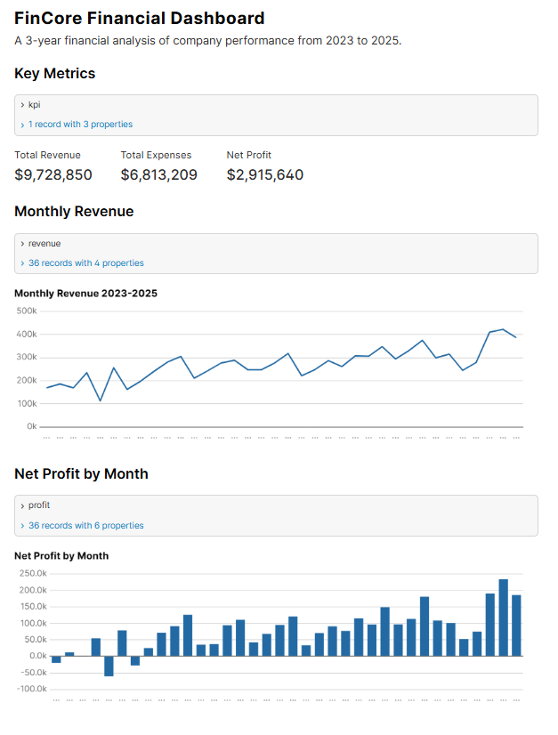
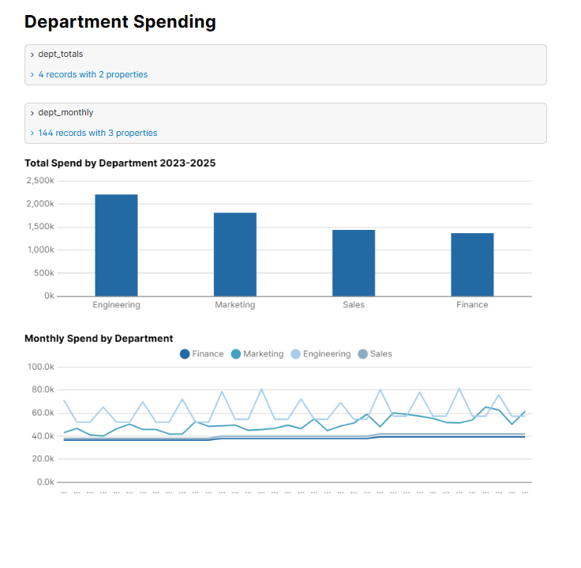

# FinCore

A finance and accounting data project built with dbt, DuckDB, and Evidence.dev.

Simulates 3 years of company financial data (2023 to 2025) using double-entry bookkeeping,
models it into a star schema using dbt, and visualises it in an Evidence.dev dashboard.

## Dashboard

## Tech stack

- DuckDB: local analytical database
- dbt Core: data modelling and transformation
- Evidence.dev: SQL-powered dashboard
- Python: synthetic data generation

## Project structure

- seeds: raw CSV data (chart of accounts, departments, journal entries)
- models/staging: standardised views over raw data
- models/marts: star schema (dimensions and facts)
- models/marts/metrics: monthly revenue, expenses, and net profit
- evidence-dashboard: dashboard pages and source queries
- generate_data.py: script to generate synthetic financial data

## Setup

1. Create and activate a Python virtual environment
2. Run: pip install dbt-duckdb
3. Run: dbt seed && dbt run && dbt test
4. Run: cd evidence-dashboard && npm install && npm run sources && npm run dev
